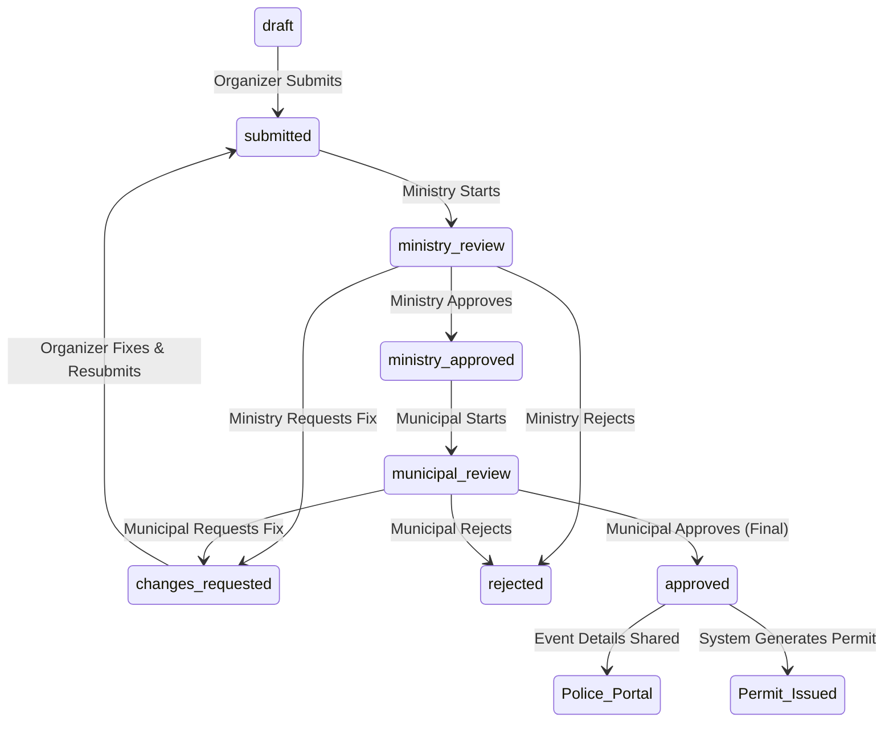

# Government Proposal Approval Workflow

This document explains the step-by-step lifecycle of a proposal submitted by an organizer, showing how it moves from initial submission through the new Ministry-first government reviews.

## Overall Flow

1. **Drafting & Submission** (Organizer)
2. **Ministry Review** (Initial Approval)
3. **Municipal / Local Government Review** (Final Approval)
4. **Police Notification / Portal** (Allowed Events)
5. **Permit Issuance**

---

### Step 1: Drafting & Submission
- An approved Organizer creates a proposal (`POST /proposals/`).
- The organizer can work on this proposal while its status is `draft`.
- Once complete, the organizer submits it (`POST /proposals/{id}/submit`).
- **Status changes to:** `submitted`.

### Step 2: Ministry Review (Initial)
- Proposals with status `submitted` enter the Ministry queue.
- A Ministry official starts review (`POST /ministry/proposals/{id}/start-review`).
  - **Status changes to:** `ministry_review` (with `review_stage = ministry`).
- They assess national impact, broader compliance, and initial green lights.
- Their options:
  1. **Request Changes**: Status becomes `changes_requested`. Organizer must fix and resubmit.
  2. **Reject**: Status becomes `rejected`. Process ends.
  3. **Approve**: (`POST /ministry/proposals/{id}/approve`)
     - **Status changes to:** `ministry_approved`.
     - *This means the Ministry has cleared it, passing it down to the Municipality.*

### Step 3: Municipal Review (Final Allowance)
- Once `ministry_approved`, the proposal enters the Municipal queue.
- A Municipal official starts their review (`POST /municipal/proposals/{id}/start-review`).
  - **Status changes to:** `municipal_review` (with `review_stage = municipal`).
- They assess local impact, venue suitability, and dates based on the city's status.
- Their options:
  1. **Request Changes**: Goes back to the organizer.
  2. **Reject**: Status becomes `rejected`. Process ends.
  3. **Approve**: (`POST /municipal/proposals/{id}/approve`)
     - **Status changes to:** `approved`.
     - *This means the local government has cleared it. The event is now fully allowed.*

### Step 4: Police Notification Portal
- The system automatically makes any proposal with the status `approved` visible in the Police Portal.
- Police officials log into their dashboard (`GET /police/proposals/`).
- They can view the event details to prepare security operations.

### Step 5: Permit Issuance
- A scheduled background job (or a manual trigger) watches for proposals that reach `approved` status.
- It generates an official Permit document/record (`POST /permits/generate`).
- The organizer is notified that their permit is ready.

---

## State Machine Summary

