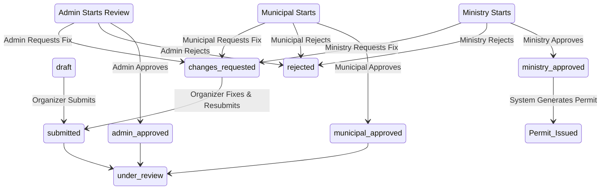

# Government Proposal Approval Workflow

This document explains the step-by-step lifecycle of a proposal submitted by an organizer, showing how it moves from initial submission through the various administrative and government reviews.

## Overall Flow

1. **Drafting & Submission** (Organizer)
2. **Initial Review** (Platform Admin)
3. **Municipal / Local Government Review**
4. **Ministry Review** (Final Approval)
5. **Permit Issuance**

---

### Step 1: Drafting & Submission
- An approved Organizer creates a proposal (`POST /proposals/`).
- The organizer can work on this proposal while its status is `draft`.
- Once complete, the organizer submits it (`POST /proposals/{id}/submit`).
- **Status changes to:** `submitted`.

### Step 2: Platform Admin Review
- Admins see the proposal in their queue.
- Admins pick it up for review (`POST /admin/proposals/{id}/start-review`).
  - **Status changes to:** `under_review` (with `review_stage = admin`).
- Admins check for completeness and platform standards.
- They have three options:
  1. **Request Changes**: Status becomes `changes_requested`. Organizer must fix and resubmit.
  2. **Reject**: Status becomes `rejected`. Process ends.
  3. **Approve**: (`POST /admin/proposals/{id}/approve`)
     - **Status changes to:** `admin_approved`.
     - *This means it's now ready for the actual government review.*

### Step 3: Municipal Review
- Once `admin_approved`, the proposal enters the Municipal queue.
- A Municipal official starts their review (`POST /municipal/proposals/{id}/start-review`).
  - **Status changes to:** `under_review` (with `review_stage = municipal`).
- They assess local impact, venue suitability, and dates.
- Their options:
  1. **Request Changes**: Goes back to the organizer.
  2. **Reject**: Status becomes `rejected`. Process ends.
  3. **Approve**: (`POST /municipal/proposals/{id}/approve`)
     - **Status changes to:** `municipal_approved`.
     - *This means the local government has cleared it, passing it up to the Ministry.*

### Step 4: Ministry Review (Final)
- Once `municipal_approved`, it enters the Ministry queue.
- A Ministry official starts review (`POST /ministry/proposals/{id}/start-review`).
  - **Status changes to:** `under_review` (with `review_stage = ministry`).
- They assess national impact, broader compliance, and final green lights.
- Their options:
  1. **Request Changes**: Goes back to the organizer (sometimes directly, or sometimes requires re-clearing lower stages depending on the change).
  2. **Reject**: Status becomes `rejected`. Process ends.
  3. **Approve**: (`POST /ministry/proposals/{id}/approve`)
     - **Status changes to:** `ministry_approved`.
     - *This is the final seal of approval.*

### Step 5: Permit Issuance
- A scheduled background job (or a manual trigger) watches for proposals that reach `ministry_approved` status.
- It generates an official Permit document/record (`POST /permits/generate`).
- The organizer is notified that their permit is ready, and they can legally host the event.

---

## State Machine Summary

